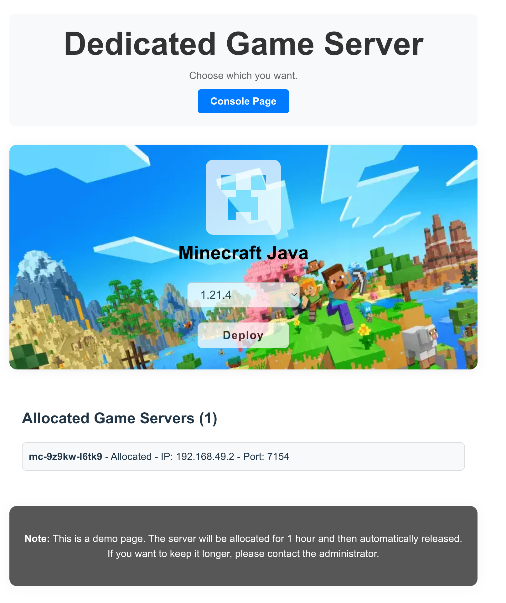
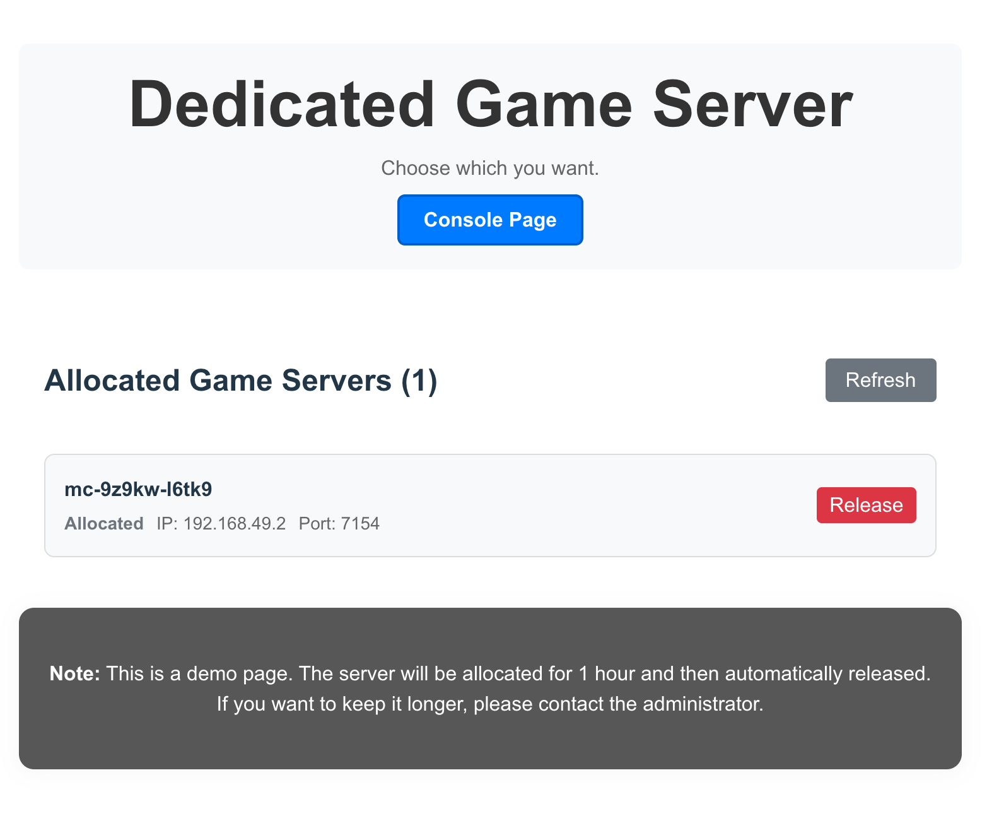

## 启动client端
```
cd client
npm install
npm run dev
```

## 启动server端
```
cd server
go run cmd/main.go
```

## 访问浏览器
```
localhost:3000
```

## web UI
#### main page


#### order page


#### select page


#### console page
